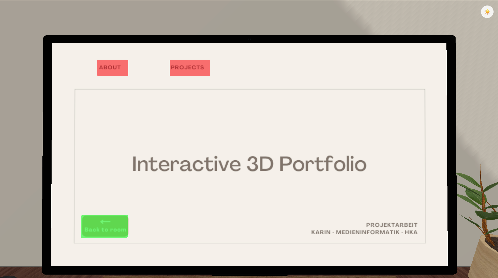

# Projektarbeit WS 25/26: Three.js Isometric Room

## Overview

Dieses Projekt zeigt einen isometrischen 3D-Raum, der mit **Blender** modelliert und mit **Three.js** in eine Webanwendung integriert wurde.  
Der Raum besteht aus mehreren Objekten wie einem Schreibtisch, einem Stuhl und einem Monitor. Zusätzlich gibt es einen **Tag-/Nacht-Modus**, der die Atmosphäre der Szene verändert.

---

## Tools & Technologien

- **Blender** – Erstellung und Export der 3D-Modelle  
- **Three.js** – Darstellung und Interaktion der 3D-Szene im Browser  
- **Vite** – Entwicklungsserver und Build-Tool  

---

## Beschreibung

Der isometrische Raum wurde von mir vollständig in Blender erstellt und als eigenständiges 3D Environment modelliert. Die Raumstruktur selbst, also Wände, Boden und der grundlegende Aufbau, ist komplett eigenständig entstanden.  
Die Möbel und Objekte innerhalb des Raumes stammen von verschiedenen Creatorinnen und Creatorn auf Sketchfab. Diese Modelle habe ich heruntergeladen, in Blender importiert und anschließend in meinen Raum eingesetzt, angepasst und positioniert, sodass sie sich stimmig in die Szene einfügen. Die Quellen zu allen verwendeten externen Modellen sind im Projekt unten verlinkt.

Nachdem alle Elemente zusammengeführt wurden, habe ich das gesamte Modell für die Nutzung im Web optimiert und als glb-Datei exportiert. Dieses Modell wird anschließend direkt in der `main.js` Datei in Three.js eingebunden.  

Im ursprünglichen Projektplan wollte ich ein **Museum** in die Szene setzen. Dabei zeigte sich jedoch, dass die Beleuchtung nicht ausreichte, um einen geschlossenen Museumsraum realistisch und gleichmäßig auszuleuchten.  
Aus diesem Grund habe ich mich für den **offeneren, isometrischen Raum** entschieden, der einfacher zu belichten ist und die Interaktivität besser unterstützt.

In Three.js wurde die komplette Szene umgesetzt, inklusive Kamera, Beleuchtung und Interaktionen. Der Monitor auf dem Schreibtisch ist als klickbares Objekt umgesetzt und ermöglicht das Wechseln zwischen verschiedenen Seiten oder Inhalten. Zusätzlich besitzt die Szene einen Tag-/Nacht-Modus, der über einen Button gesteuert wird.  
Im Tag-Modus ist der Raum hell und neutral ausgeleuchtet, im Nacht-Modus wird eine stimmungsvolle, dunklere Atmosphäre erzeugt.

---

## Features
- Isometrischer 3D-Raum  
- Importierte und angepasste 3D-Assets aus Blender  
- Klickbarer Monitor mit mehreren Zuständen  
- Tag-/Nacht-Modus per Button

---

## Schnellstart

### Systemvoraussetzungen
- Node.js
- npm

### Installation & Start
```bash
# Repository klonen und ins Projektverzeichnis wechseln
git clone https://github.com/karintrn/threejs-project.git
cd threejs-project

# Abhängigkeiten installieren
npm install

# Projekt starten
npm run dev

## Im Browser ansehen
Standardmäßig unter: http://localhost:5173
```
---

## Three.js Grundlagen im Projekt

Die Szene in Three.js folgt dem klassischen Aufbau:

1. **Szene (Scene)** – enthält alle Objekte, Lichtquellen und Hilfsmittel.  
2. **Kamera (Camera)** – definiert den Blickwinkel auf die Szene. Hier kommt eine perspektivische Kamera zum Einsatz.  
3. **Renderer (WebGLRenderer)** – rendert die Szene in das HTML-Canvas und aktualisiert die Darstellung bei Interaktionen oder Animationen.  

Die Szene enthält sowohl mein **importierts 3D-Modelle aus Blender**, als auch **primitive Objekte**, die direkt in Three.js erzeugt wurden, wie z. B. Kugeln.  
Das Ziel war es zu demonstrieren, dass man in Three.js auch ohne externe Modelle einfache Formen erzeugen kann, allerdings ist das Angebot an Formen begrenzt (z. B. Boxen, Kugeln, Kegel), weshalb komplexere Objekte wie Möbel oder ganze Räume weiterhin in Blender erstellt werden müssen.

Zusätzlich habe ich zwei Lichtquellen gesetzt, Schattenberechnung aktiviert und die Interaktivität implementiert (z. B. klickbarer Monitor, Tag-/Nacht-Modus).  
Dieses Projekt verdeutlicht somit die grundlegenden Konzepte von Three.js: Szene, Kamera, Renderer, Licht und Objekte, sowie einfache Interaktionen.

### Interaktivität mit Raycasting

Um Objekte in der 3D-Szene anklickbar zu machen, habe ich den **Raycaster** in eine eigene Datei `raycaster.js` ausgelagert.  
Dies sorgt für sauberen und wiederverwendbaren Code.  

Funktionsweise:

- Ein Strahl wird von der Kamera zur Mausposition gesendet.  
- Alle Objekte in der Szene werden auf Schnittpunkte überprüft.  
- Objekte mit bestimmten Namen (z. B. der Monitor) werden anschließend ausgewählt.  

Ziel: Es sollte demonstriert werden, dass man auf bestimmte Objekte in der Szene klicken und Interaktionen auslösen kann, ohne die Hauptdatei `main.js` zu überladen.

### Kameratransitionen & Animationen

Um die Bewegung der Kamera flüssig zu gestalten, kommt die Bibliothek **GSAP** zum Einsatz.  
Die Kamera kann z. B. beim Klick auf den Monitor sanft auf eine neue Position wechseln und wieder zurück.  

- `defaultTransition()` – fährt die Kamera zu einem Fokuspunkt (z. B. Monitor)  
- `resetTransition()` – fährt die Kamera zurück zur Ausgangsposition  

Ziel: Es sollte gezeigt werden, dass man Kamerapositionen in Three.js mit externen Animationsbibliotheken wie GSAP elegant und flüssig steuern kann.

---

## Herausforderungen und Probleme

### Ladezeiten und Benutzererfahrung

Beim ersten Start des Projekts konnte es manchmal einige Sekunden dauern, bis alle 3D-Modelle und Texturen im Browser geladen waren.  
Dadurch sah man, wie die Szene nach und nach gerendert wurde, was visuell unschön wirkte.  

Um die Benutzererfahrung zu verbessern, habe ich einen **einfachen Loading Screen** mit Start-Knopf implementiert.  
Er zeigt an, dass die Szene noch geladen wird, und ermöglicht dem Nutzer, erst dann in den Raum zu wechseln, wenn alles vollständig bereit ist.

### Beleuchtung und Schatten

Die Beleuchtung war eine der größten Herausforderungen des Projekts.
Das Zusammenspiel aus verschiedenen Lichtquellen, deren Positionierung sowie die Einstellung von Intensität und Farbe erforderte viel Feinarbeit.

```code
const sunLight = new THREE.DirectionalLight(0xffffff, 4); // white sunlight
sunLight.position.set(-100, 100, 40); // sun direction
sunLight.castShadow = true;
// soft shadows
sunLight.shadow.mapSize.width = 4096;
sunLight.shadow.mapSize.height = 4096;
sunLight.shadow.camera.left = -50;
sunLight.shadow.camera.right = 50;
sunLight.shadow.camera.top = 50;
sunLight.shadow.camera.bottom = -50;
sunLight.shadow.camera.near = 1;
sunLight.shadow.camera.far = 280;

scene.add(sunLight);
```
Besonders die Umsetzung von Schatten erwies sich als schwierig. Um saubere und realistische Schatten zu erzeugen, mussten viele Parameter angepasst werden, wobei kleine Änderungen oft große visuelle Auswirkungen hatten. Eine realistische Simulation von Sonnen- und Mondlicht ist zwar möglich, jedoch sehr aufwendig und für den Projektumfang nur eingeschränkt sinnvoll.
Ursprünglich wollte ich ein Museum in der Szene umsetzen, doch die geschlossene Architektur war zu schwierig realistisch auszuleuchten. Deshalb habe ich den isometrischen Raum gewählt, der offener ist und sich besser für Three.js eignet.
### Monitor Interaktion
Ein weiterer Problembereich war die Umsetzung eines interaktiven Bildschirms im 3D-Raum.
Der ursprüngliche Ansatz, Inhalte mithilfe von eingebettetem HTML oder iFrames darzustellen, erwies sich als ungeeignet.


Die Inhalte ließen sich nicht stabil am Bildschirm fixieren und waren teilweise auch von der Rückseite sichtbar, was das visuelle Ergebnis stark beeinträchtigte.
Um dieses Problem zu lösen, habe ich einen alternativen Ansatz gewählt, der vollständig innerhalb der 3D-Szene funktioniert.

### Lösungsansatz für Monitor Interaktion

Statt komplexe HTML-Einbettungen zu verwenden, arbeitet der Bildschirm mit verschiedenen **Modi**:

- `room` – normaler Raummodus  
- `screen` – Fokus auf den Bildschirm  
- `about` – Informationsansicht innerhalb des Bildschirms  
- `projects` – Projektansicht innerhalb des Bildschirms  

Für alle Modi außer `room` gibt es eigene **PNG-Bilder**, die im Ordner `public/textures` abgelegt sind.  
- Startseite: für den Modus `screen`  
- About-Seite: für den Modus `about`  
- Projects-Seite: für den Modus `projects`  

Diese Bilder wurden in **Canva** erstellt und werden abhängig von der geklickten **Hitbox** auf dem Monitor angezeigt.  
Je nach aktivem Modus werden unterschiedliche **Hitboxen** aktiviert und per Klick abgefragt, wodurch die gewünschte Interaktivität zuverlässig umgesetzt werden konnte,  ohne unnötige technische Komplexität.  



---

## Fazit

Das Projekt verdeutlicht, dass Three.js ein sehr mächtiges Werkzeug ist, mit dem sich komplexe 3D-Anwendungen im Browser umsetzen lassen. Gleichzeitig zeigt es aber auch, dass viele Funktionen, insbesondere Beleuchtung, Schatten und Interaktionen, mit einem hohen Aufwand verbunden sind.
Für dieses Projekt war es daher sinnvoll, an einigen Stellen bewusst auf vereinfachte Lösungen zurückzugreifen. Dadurch konnte die Funktionalität klar und stabil umgesetzt werden, ohne den Rahmen des Projekts zu sprengen.
Insgesamt bietet Three.js großes Potenzial, erfordert jedoch Zeit, Geduld und ein gutes Verständnis der zugrunde liegenden Konzepte.


## Quellen

* https://www.cgtrader.com/items/3671361/download-page
* https://www.cgtrader.com/free-3d-models/furniture/table/ikea-desk-90ea611d-4217-48e7-9fd4-eb5ba3e55b32
* https://www.cgtrader.com/free-3d-models/electronics/computer/free-mechanical-keyboard-3d-model
* https://medium.com/@gianluca.lomarco/
* https://sketchfab.com/3d-models/modern-wall-shelves-4a96ad955daa4f0194bde2036070d6ba
* https://sketchfab.com/3d-models/bedroom-heater-radiator-cf24a4c7948b487596c06e0b1e716a09#download
* https://sketchfab.com/3d-models/office-chair-b228a29fa84544c2be501c295653ffe7
* https://sketchfab.com/3d-models/japanese-lamp-aae37f2c1dc848378f37f4c5fd6255f0
* https://sketchfab.com/3d-models/desk-plant-a63c3409aa9e4ac08fe152ca1dabe132#download
* https://sketchfab.com/3d-models/apple-studio-display-f56b9892c6b941168f64bc8323c98875#download
* https://sketchfab.com/3d-models/white-logitech-g305-be26b2d7187f49459cfeef60c7c3272e#download
* https://sketchfab.com/3d-models/wooden-desk-monitor-raiser-stand-61a815ff708e4bd095d2c3ee16b55d6f