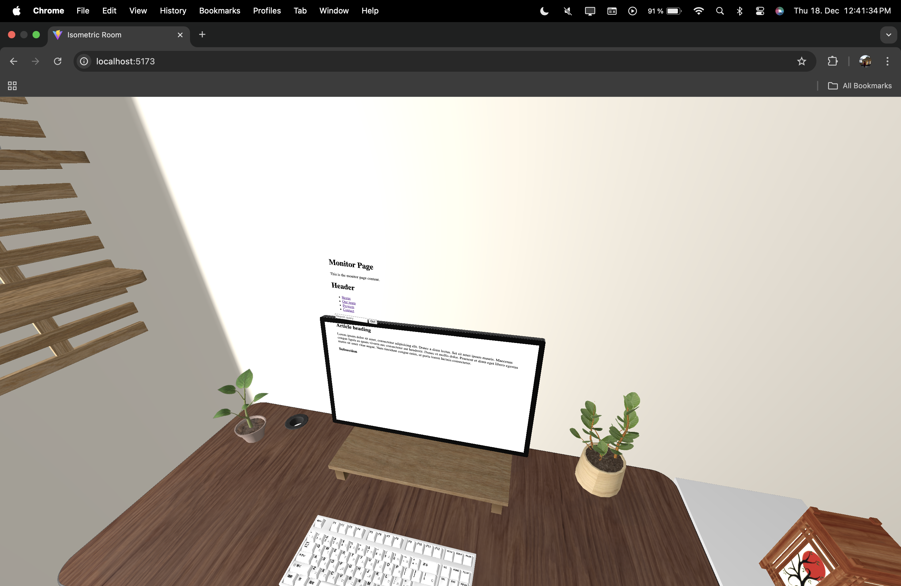

# Three.js Isometric Room

## Overview

Dieses Projekt zeigt einen isometrischen 3D-Raum, der mit **Blender** modelliert und mit **Three.js** in eine Webanwendung integriert wurde.  
Der Raum besteht aus mehreren Objekten wie einem Schreibtisch, einem Stuhl und einem Monitor. Zusätzlich gibt es einen **Tag-/Nacht-Modus**, der die Atmosphäre der Szene verändert.

---

## Tools & Technologien

- **Blender** – Erstellung und Export der 3D-Modelle  
- **Three.js** – Darstellung und Interaktion der 3D-Szene im Browser  
- **Vite** – Entwicklungsserver und Build-Tool  

---

## Beschreibung

Der isometrische Raum wurde von mir vollständig in Blender erstellt und als eigenständiges 3D Environment modelliert. Die Raumstruktur selbst, also Wände, Boden und der grundlegende Aufbau, ist komplett eigenständig entstanden.
Die Möbel und Objekte innerhalb des Raumes stammen von verschiedenen Creatorinnen und Creatorn auf Sketchfab. Diese Modelle habe ich heruntergeladen, in Blender importiert und anschließend in meinen Raum eingesetzt, angepasst und positioniert, sodass sie sich stimmig in die Szene einfügen. Die Quellen zu allen verwendeten externen Modellen sind im Projekt unten verlinkt.
Nachdem alle Elemente zusammengeführt wurden, habe ich das gesamte Modell für die Nutzung im Web optimiert und als glb-Datei exportiert. Dieses Modell wird anschließend direkt in der main.js Datei in Three.js eingebunden.
In Three js wurde die komplette Szene umgesetzt, inklusive Kamera, Beleuchtung und Interaktionen. Der Monitor auf dem Schreibtisch ist als klickbares Objekt umgesetzt und ermöglicht das Wechseln zwischen verschiedenen Seiten oder Inhalten.
Zusätzlich besitzt die Szene einen Tag Nacht Modus, der über einen Button gesteuert wird.
Im Tag Modus ist der Raum hell und neutral ausgeleuchtet und vermittelt eine klare und ruhige Atmosphäre.
Der Nacht Modus verwendet eine dunklere und stimmungsvollere Beleuchtung mit angepassten Lichtquellen, wodurch eine atmosphärische Wirkung entsteht.
Durch die Kombination aus eigenem Modeling, externen Assets, interaktiven Elementen und dynamischer Beleuchtung entsteht ein interaktiver isometrischer Raum, der gezielt für den Einsatz im Web konzipiert ist.

---

## Features

- Isometrischer 3D-Raum  
- Importierte und angepasste 3D-Assets aus Blender  
- Klickbarer Monitor mit mehreren Zuständen  
- Tag-/Nacht-Modus per Button

---

## Getting Started

### Prerequisites

- Node.js
- npm

### Installation & Start

```bash
cd room
npm install
npm run dev
```

---

## Herausforderungen und Probleme

### Beleuchtung und Schatten

Die Beleuchtung war eine der größten Herausforderungen des Projekts.  
Das Zusammenspiel aus verschiedenen Lichtquellen, deren Positionierung sowie die Einstellung von Intensität und Farbe erforderte viel Feinarbeit.

Besonders die Umsetzung von **Schatten** erwies sich als schwierig. Um saubere und realistische Schatten zu erzeugen, mussten viele Parameter angepasst werden, wobei kleine Änderungen oft große visuelle Auswirkungen hatten. Eine realistische Simulation von Sonnen- und Mondlicht ist zwar möglich, jedoch sehr aufwendig und für den Projektumfang nur eingeschränkt sinnvoll.

### Monitor Interaktion

Ein weiterer Problembereich war die Umsetzung eines **interaktiven Bildschirms** im 3D-Raum.  
Der ursprüngliche Ansatz, Inhalte mithilfe von eingebettetem HTML oder iFrames darzustellen, erwies sich als ungeeignet.



Die Inhalte ließen sich nicht stabil am Bildschirm fixieren und waren teilweise auch von der Rückseite sichtbar, was das visuelle Ergebnis stark beeinträchtigte.

Um dieses Problem zu lösen, habe ich einen alternativer Ansatz gewählt, der vollständig innerhalb der 3D-Szene funktioniert.

---

## Lösungsansatz

Statt komplexe HTML-Einbettungen zu verwenden, arbeitet der Bildschirm mit verschiedenen **Modi**:

- `room` – normaler Raummodus  
- `screen` – Fokus auf den Bildschirm  
- `about` – Informationsansicht innerhalb des Bildschirms  
- `projects` – Projektansicht innerhalb des Bildschirms  

Je nach aktivem Modus werden unterschiedliche **Hitboxen** aktiviert und per Klick abgefragt. Dadurch konnte die gewünschte Interaktivität zuverlässig umgesetzt werden, ohne unnötige technische Komplexität.

---

## Fazit

Das Projekt verdeutlicht, dass **Three.js** ein sehr mächtiges Werkzeug ist, mit dem sich komplexe 3D-Anwendungen im Browser umsetzen lassen. Gleichzeitig zeigt es aber auch, dass viele Funktionen – insbesondere Beleuchtung, Schatten und Interaktionen – mit einem hohen Aufwand verbunden sind.

Für dieses Projekt war es daher sinnvoll, an einigen Stellen bewusst auf vereinfachte Lösungen zurückzugreifen. Dadurch konnte die Funktionalität klar und stabil umgesetzt werden, ohne den Rahmen des Projekts zu sprengen.

Insgesamt bietet Three.js großes Potenzial, erfordert jedoch Zeit, Geduld und ein gutes Verständnis der zugrunde liegenden Konzepte.


## Probleme
* Lichter und ihre Ausrichtung (Beleuchtung)
- imitieren von Sonnenlicht und Mondlicht möglich, jedoch viel zu komplex

* Bilschirm embedded html und iframes
- Hier war das mit html zu komplex und es hat sich immer von bildschirm entfernt anstatt daran zu kleben
- Lösung: bilder verwenden und dann verschiedene Modi setzen und dann erst darin bestimmte hitboxen abfragen


## Acknowledgments

3d models
* https://www.cgtrader.com/items/3671361/download-page
* https://www.cgtrader.com/free-3d-models/furniture/table/ikea-desk-90ea611d-4217-48e7-9fd4-eb5ba3e55b32
* https://www.cgtrader.com/free-3d-models/electronics/computer/free-mechanical-keyboard-3d-model
* https://medium.com/@gianluca.lomarco/
* https://sketchfab.com/3d-models/modern-wall-shelves-4a96ad955daa4f0194bde2036070d6ba
* https://sketchfab.com/3d-models/bedroom-heater-radiator-cf24a4c7948b487596c06e0b1e716a09#download
* https://sketchfab.com/3d-models/office-chair-b228a29fa84544c2be501c295653ffe7
* https://sketchfab.com/3d-models/japanese-lamp-aae37f2c1dc848378f37f4c5fd6255f0
* https://sketchfab.com/3d-models/desk-plant-a63c3409aa9e4ac08fe152ca1dabe132#download
* https://sketchfab.com/3d-models/apple-studio-display-f56b9892c6b941168f64bc8323c98875#download
* https://sketchfab.com/3d-models/white-logitech-g305-be26b2d7187f49459cfeef60c7c3272e#download
* https://sketchfab.com/3d-models/wooden-desk-monitor-raiser-stand-61a815ff708e4bd095d2c3ee16b55d6f
* 
* 

three-js-vite-basic-scene-tutorial-3abc2669da6d (?)

Inspiration, code snippets, etc.
* [awesome-readme](https://github.com/matiassingers/awesome-readme)
* [PurpleBooth](https://gist.github.com/PurpleBooth/109311bb0361f32d87a2)
* [dbader](https://github.com/dbader/readme-template)
* [zenorocha](https://gist.github.com/zenorocha/4526327)
* [fvcproductions](https://gist.github.com/fvcproductions/1bfc2d4aecb01a834b46)